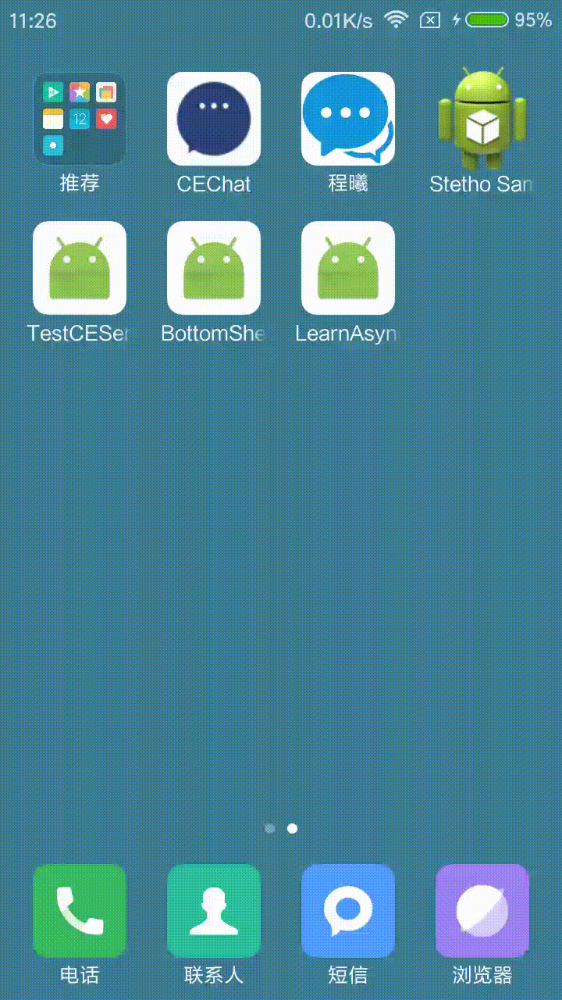

# LearnAsyncTask

前言：AsyncTask的本身其实是对Handle机制的封装，目的是让异步操作的实现变得简单，更多的关注业务实现。

使用AsyncTask异步任务类的基本步骤：

1.创建一个继承自AsyncTask的类。

2.确定AsyncTask<Params（参数）, Progress（进度）, Result（结果）> 泛型的三个参数类型。

3.重写以下方法：

> ```java
> protected void onPreExecute() //可选
>
> protected abstract Result doInBackground(Params... params); //必须重写
>
> protected void onPostExecute(Result result) //可选，但一般都会重写
>
> protected void onProgressUpdate(Progress... values) //可选,如果不需要进度可以写Void（大写的V）
> ```

注意：

`onPreExecute` 方法会在execute方法调用前调用，运行在UI线程，**可以做进度框的展示等** ；

`doInBackground`方法的参数是可选参数，类型由创建类时决定，并且该方法是执行在子线程中的，**可以做一些耗时操作**；

`onPostExecute` 方法的参数也是创建类时决定，可以是String、Bitmap类型等，运行在UI线程中，根据返回的result，这里的result的类型就是`doInBackground` 的返回值类型，因此**可以更新UI** ；

`onProgressUpdate` 方法的参数是可选参数，**可以展示任务处理的进度**，不过需要通过在`doInBackground` 中根据下载内容占总下载内容的比例主动调用`publishProgress` 方法，才会回调`onProgressUpdate` 方法。

4.实例化该异步任务类，并调用` AsyncTask<Params, Progress, Result> execute(Params... params)` 方法启动任务。


在本项目中，使用了两种常用的返回类型的异步任务类，分别完成下载api返回的String类型的json数据并解析成集合数据和Bitmap类型的图片的任务，主要代码如下：

这里我取的是知乎日报的获取最近消息的api，感谢大神的共享，先上api文档链接：https://github.com/izzyleung/ZhihuDailyPurify/wiki/%E7%9F%A5%E4%B9%8E%E6%97%A5%E6%8A%A5-API-%E5%88%86%E6%9E%90

第一种类型：

```java
private class StoryAsyncTask extends AsyncTask<String, Viod, List<Story.StoriesBean>> {

    @Override
    protected List<Story.StoriesBean> doInBackground(String... params) {
        return getJsonString(params[0]);//参数个数为1，下标则为0
    }

    @Override
    protected void onPostExecute(List<Story.StoriesBean> stories) {
        mAdapter.addListData(stories);//直接返回adapter所需要的集合类型，为什么这样做？俩字儿“方便”
        mRefreshLayout.setRefreshing(false);
    }
}
```

第二种类型：

```java
private class ImgLoaderAsyncTask extends AsyncTask<String, Void, Bitmap> {
  
    private ImageView mImageView;
    private String mUrl;

    public ImgLoaderAsyncTask(ImageView imageView, String url) {
        mImageView = imageView;
        mUrl = url;
    }

    @Override
    protected Bitmap doInBackground(String... params) {
        String url = params[0];
        //从网络上获取到的图片存到缓存中
        Bitmap bitmap = getBitmapFromUrl(url);
        if (bitmap != null) {
            addBitmapToCache(url, bitmap);
        }
        return bitmap;
    }

    @Override
    protected void onPostExecute(Bitmap bitmap) {
        super.onPostExecute(bitmap);
        if (mImageView.getTag().equals(mUrl)) { //请注意，这里多加了tag的判断，为了让图片不错乱
            mImageView.setImageBitmap(bitmap);
        }
    }
}
```

相关：关于cache的部分，请点击***进行查看。

</img>

另外附上AsyncTask异步任务之源码解析：http://blog.csdn.net/maplejaw_/article/details/51441312
